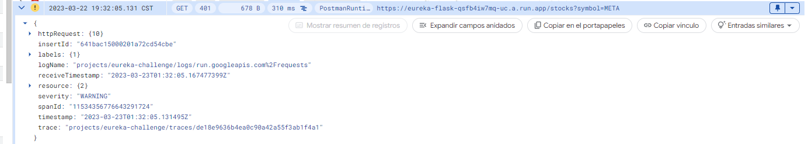

# Flask API example

## Introduction

This repository contains a sample Flask REST API with two endpoints.

## Running locally

This project can be run both locally and using Docker. The easiest way to run it is using Docker compose, since it automatically creates a MongoDB container.

### Local

#### Requirements

- Python > 3.10
- MongoDB instance

**Note**: It is recommended to use a virtualenv for local testing

#### Instructions

1. Clone this repository: `git clone https://github.com/TavoJG/flask-api-example.git`
2. Go to app directory `cd flask-api-example`
3. Install Python requirements `pip install -r requirements.txt`
4. Create a .env file and configure env variables (use [example.env](./example.env) as placeholder)
5. Run application: `flask run --debug`

### Docker

#### Requirements

- Docker
- Docker compose

#### Instructions

1. Create a .env file and configure env variables (use [example.env](./example.env) as placeholder)
2. Run `docker compose up -d`, service should start automatically at `http://localhost:8080`

## Running tests

This project uses pytest for automated testing. For run all test, just type `pytest`

## Usage

### Sign up

A new user can be created by doing a **POST** request to `/sign_up` endpoint, sending a JSON body with following parameters:

```
{
    "email": "test@test.com",
    "firstName": "Test",
    "lastName": "Guy"
}
```

Endpoint response contains an API key inside a JSON object:

```
{
    "apiKey": API_KEY
}
```

**NOTE**: Duplicated emails are not allowed. If a existing email is sent into request, endpoint will response with a Bad Request error.

### Stocks

Stock market information can be retrieved by sending a **GET** request to `/stocks` endpoint, sending a valid stock symbol as query parameter:

```
GET /stocks?symbol=META
```

This endpoint requires a valid API key inside **Authorization** header. Key should have following format:

```
Authorization: Token TOKEN
```

If the API key is valid and stock symbol exists, endpoint will response with last stock information. Otherwise, endpoint will return an Error

```
{
    "closingPriceVariation": "-2.35",
    "date": "2023-03-22",
    "higherPrice": "207.37",
    "lowerPrice": "199.67",
    "openPrice": "202.5"
}

```

## Continuous Integration

This project has a CI pipeline built with GitHub actions. A Docker image is built and saved into Dockerhub when a PR is merged into main branch. Image name is `tavojg54/flask-test-api`.

## Deployment

This project runs inside GCP, into a Cloud Run instance. Terraform files can be consulted inside [terraform](./terraform/) folder.

### Logging

Logs are managed by GCP Logging.

